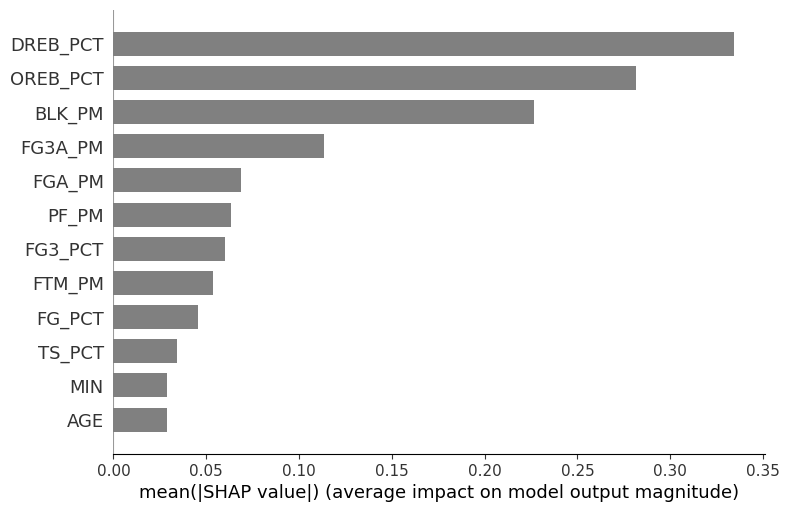
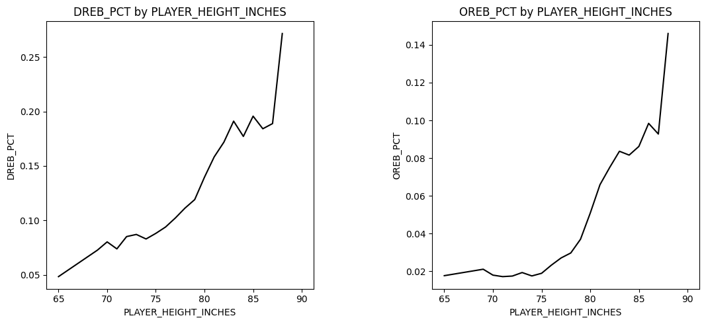

[![website-img]][website link]
[![website-project-img]][website-project link] 
[![results-img]][results link]
[![attributes-img]][attributes link]

[website-img]: https://img.shields.io/badge/Website-me9hanics.github.io-blue?style=flat-square
[website link]: https://me9hanics.github.io/
[website-project-img]: https://img.shields.io/badge/Project_subpage-grey?style=flat-square
[website-project link]: https://me9hanics.github.io/projects/nba-height-prediction.html
[results-img]: https://img.shields.io/badge/Results-darkgreen?style=flat-square
[results link]: https://github.com/me9hanics/ml-nba-height-from-performance?tab=readme-ov-file#results-table
[attributes-img]: https://img.shields.io/badge/Attributes_predictive_power-darkgreen?style=flat-square
[attributes link]: https://github.com/me9hanics/ml-nba-height-from-performance?tab=readme-ov-file#how-do-attributes-correlate-with-height-what-do-the-results-show

# NBA Height Prediction from Performance

Machine learning models used to predict the height of basketball players, from playstyle and performance statistics. Data collected using the `nba_api` package, of the previous 20 seasons.

- Models: Gradient boosted regressors and classifiers, random forests
- Data analysis: Clustering, preparing clean data for better performance.

The results show, that two regressors (one gradient boosted, and a random forest regressor) can predict the height of a player **within 1 inch 50% of the time**. Moreover, on the data the latter model predicted inside the (-7, 5) inch error range for every player; predicting inside +-2 inches for 72.9% of the players, and +-3 inches for 86.4% of the players.

**Preprocessing, analysis, prediction:**: inside the `ml.ipynb` notebook  
**Data collection, some cleaning**: described in `fetch_players.ipynb`. 
Data is stored in the `data` folder, the combined data for training in the `data_combined.csv` file.

The pipeline picture:

    

A summary of the best models:

| Model                                                | Accuracy Score | +/-1 inch % | +/-2 inch % | +/-3 inch % | F1 Score | Error Range   |
|------------------------------------------------------|----------------|-------------|-------------|-------------|----------|---------------|
| Random forest classifier                       | **17.6%**      | 45.3%       | 70.3%       | 83.7%       | **0.155**| -8 , 6        |
| Ensembled (manually biased) forest                   | 16.2%          | **49.0%**   | **71.3%**   | **85.4%**   | 0.149    | -8 , 5        |
| Best RF regressor                                    | -              | **50.0%**   | **72.9%**   | **86.4%**   | -        | **-7 , 5**    |
| Best gradient boosted regressor                      | -              | **49.9%**   | 69.1%       | 84.5%       | -        | -8 , 6        |

## How..?

### How to run?

- I recommend to just download (clone) the whole repository.

After downloading the repository, in your command line shell go to this directory, choose/create a `Python`/`conda`/`virtualenv` environment and run `pip install -r requirements.txt`.(The dependencies are listed both in the `requirements.in` and the `requirements.txt` files.) 
Then just run the `ml.ipynb` notebook cells in some Jupyter environment.

If you want to fetch the data yourself (which is already fetched and stored in the `data` folder), you additionally need to run `pip install nba_api` to use the package, in the `fetch_players.ipynb` notebook. 

### How is the data collected and processed?

- Collected using the `nba_api` package, from the NBA stats website.

The NBA website has a [statistics](https://www.nba.com/stats) subpage (and other subpages for other data) containing data about team statistics and player statistics, including biography (height, weight, age etc.) and career stats. There are multiple APIs provided by the website, but conviniently the `nba_api` package provides one Python interface to these APIs. The data is collected using this package, as shown in the `fetch_players.ipynb` notebook. 
The separate career (and filtered career) and biographical datasets are stored in the respective `csv` files.

To rightly train models, data is combined, processed and saved (in the general form for most models) in the `data_combined.csv` file. This procedure is described in the `ml.ipynb` notebook. (An example step is to normalize statistics by minutes played to get more meaningful features, or removing players who played less than 3 matches time in a season.)

Typical instances of the final dataframe are:

| PLAYER_ID | SEASON_ID | AGE | PLAYER_HEIGHT_INCHES | PLAYER_WEIGHT | OREB_PCT | DREB_PCT | TS_PCT | MIN   | FGA_PM  | FG_PCT  | FG3A_PM | FG3_PCT | FTM_PM  | BLK_PM | PF_PM  |
|-----------|------------|-----|----------------------|----------------|----------|----------|--------|--------|---------|---------|---------|---------|---------|--------|--------|
| 1630639   | 2022-23    | 22  | 78                   | 179            | 0.046    | 0.152    | 0.589  | 217    | 0.40553 | 0.662667| 0.230415| 0.266667| 0.018433| 0.0    | 0.101382|
| 1631260   | 2022-23    | 23  | 77                   | 190            | 0.016    | 0.105    | 0.607  | 345    | 0.362319| 0.424   | 0.304348| 0.419   | 0.011594| 0.0    | 0.089855|
| 203932    | 2021-22    | 27  | 80                   | 235            | 0.086    | 0.136    | 0.617  | 2055   | 0.370316| 0.564   | 0.084185| 0.347   | 0.092944| 0.024818| 0.062774|

We predict the `PLAYER_HEIGHT_INCHES` from the other attributes. As one can see from the table, aside defensive and shooting statistics there are assist statistics as well. The key predictors are the rebounds, and personal fouls - a higher value of these generally predicts higher height value. 

The explanation of the attributes is given in the `Explanation of attributes` section below, and in the `ml.ipynb` notebook.

### How were the models chosen and trained?

- Random forests, gradient boosted models, and specially ensembling forests were chosen, and a tree for comparison. Training and test data is split in a way, that every player appears in only one of the datasets.

As instances of data (players) are rare, noisy (players play very different regardless of height) but attributes are common, more basic models are good choices such as random forests. For improved results, gradient boosted models are also trained. These models however don't have enough data and computing power (e.g. hyperparameter tuning) to perform as well as they could, and typically performed only comparably when initialized with the random forest models. 
(Random forests cannot enable indirect relationships between the target and the features, but gradient boosted models can learn these. For example, age clearly doesn't correlate with height. However, a player's performance strongly develops with age, and we predict height from performance - therefore the age attribute could indeed indirectly be useful.)

The models:

- Decision tree: simple model, hyperparameter tuned - just for comparison
- Random forest classifier: hyperparameter tuned
- Ensemble forests: A simple random forest-like model (most common choice, "argmax") and a model that averages the predictions of the trees. (The latter is more biased, hence less common, but does better in most important metrics here.)
- Random forest regressor: using the same hyperparameters as the classifier
- Gradient boosted classifiers: Both hyperparameter tuned, and not tuned. Among the untuned models, the strongest predictor was initialized with the random forest classifier.
- Gradient boosted regressors: initialized with the random forest regressor.

Training and test data is split in a way, that every player appears in only one of the datasets (players have multiple instances, because of multiple seasons, etc.). 
To show the strength of this organization of instances, two models were also trained on shuffled data. The results showed it is better to train the models no player appearing in both train and test datasets.

### How do the models compare?

There are multiple metrics to compare the models.

- **Accuracy**: The percentage of correct predictions. (Only for classifiers.)
- **+-1 inch accuracy, +-2, +-3**: The percentage of predictions that are within 1 inches of the true height.
- **F1 score**: The harmonic mean of precision and recall. (Only for classifiers.)

### How do attributes correlate with height? What do the results show?

According to the random forest classifier SHAP values, this is the importance (impact, Shapley value) ranking of the attributes:

    

As we can see, both age and minutes played matter the least, considerably less than any other attribute - indicating that they likely do not matter at all. 
However, random forests can only model direct relationships, not indirect ones - and we know that age (and minutes) correlates with performance, which we use to predict height. Hence these attributes for gradient boosted models could be more important than showcased here, and may be utilized better for better predictions.

The rebound attributes are most important, followed by the personal fouls, these stand out among the other attributes. This proved our initial hypothesis, formed from the data exploration and analysis:

    

There is a steady increase in rebounds with height, these were clear indicators that the rebound statistics are good predictors of height.

## Results table

| Model                                                | Data | Accuracy Score | +/-1 inch % | +/-2 inch % | +/-3 inch % | F1 Score | Error Range   |
|------------------------------------------------------|------|----------------|-------------|-------------|-------------|----------|---------------|
| Decision tree                                        | All  | 15.7%          | 42.8%       | 67.7%       | 81.3%       | 0.154    | -8 , 7        |
| Random forest classifier                             | All  | **17.6%**      | 45.3%       | 70.3%       | 83.7%       | **0.155**    | -8 , 6        |
| Ensemble forest 1                                    | All  | 15.5%          | 44.9%       | 70.2%       | 83.0%       | 0.137    | -8 , 6        |
| Ensemble forest averaging                            | All  | 16.2%          | **49.0%**   | **71.3%**   | **85.4%**   | 0.149    | -8 , 5        |
| Random forest regressor                              | All  | -              | **50.0%**   | **72.9%**   | **86.4%**   | -        | **-7 , 5**    |
| Gradient boosted classifier, no tuning, previous parameters | All  | 17.1%   | 44.5        | 64.9%       | 78.9%       | 0.169    | -14 , 9       |
| Gradient boosted classifier, with hyperparameter tuning| All| 15.2%          | 41.6%       | 65.7%       | 79.3%       | 0.131    | -8 , 12       |
| Gradient boosted classifier, with tuning, initialized from RF| All | 15.8%   | 43.5%       | 67.4%       | 81.3%       | 0.148    | -8 , 6        |
| Gradient boosted regressor (from the RF model)       | All  | -              | **49.9%**       | 69.1%       | 84.5%       | -        | -8 , 6        |
| Gradient boosted classifier, with shuffled data  | Shuffled | 8.8%           | 28.1%       | 43.4%       | 59.8%       | 0.087    | -14 , 11      |
| Gradient boosted regressor, with shuffled data   | Shuffled | -              | 38.6%       | 67.1%       | 82.8%       | -        | -12 , 6       |

The gradient boosted methods underperformed likely because of lack of data, and the scikit-learn implementation not being state of the art (like XGBoost). 
**Classifiers**: In **accuracy**, only are used for evaluation, and the **random forest classifier** does the best with **17.6%** (and had the highest F-score), only the gradient boosted classifier initialized from its parameters manages to go above 17% accuracy. The **averaging ensemble forest method** however had the **best scores in all other categories (+-N inch ranges, error range)**, and came close to the best regressor method in all categories.

**Regressors**: We find that random forest regressor works, as the only model hitting **50% accuracy in the +-1 inch range**. It also hits the highest score in all other categories: **72.9% +-2 inch accuracy, 86.4% +-3 inch accuracy, and -7,5 error range**. 
Among the gradient boosted regressors, only the regressor initialized from the random forest does comparably, with 49.9% accuracy in +-1 inch range. 

This means, that the random forest regressor can **predict the height of a player within 1 inch half of the time**. This is a strong result for such a noisy problem. 

We also see that it is better to train the model with players not appearing in both train and test datasets. 

Outdated summary [pdf file](https://github.com/me9hanics/ml-nba-height-from-performance/blob/main/ml-nba-height-from-performance.pdf) for overall explanation.

Link on my [personal website](https://me9hanics.github.io/): [Projects](https://me9hanics.github.io/projects.html), [NBA Height Prediction](https://me9hanics.github.io/projects/nba-height-prediction.html) (to be added).

## Attributes: Explanation & importance

|Attribute|Meaning|Extra info|
|---|---|---|
|MIN|minutes   |   |
|FG, FG3, FT|Field goal (2 point goals), field goal 3 pointers, free throws ("penalty throws", 1 point)-  |M: Made (scored), A: attempted, PCT: percentage    |
| REB  |Rebounds   |OREB/DREB: Offensive/defensive rebound  |
|AST|Assists   |AST_PCT: Assist percentage   |
|STL|Steals   |   |
|BLK|Blocks   |   |
|TOV|Turnovers   | Negative statistic  |
|PF|Personal fouls   | Negative statistic  |
|PTS|Points   |   |
|---|--------------------------------------------------------------------| --------------------------------------------------------------------  |
|DRAFT|Each year before the season starts, 60(?) college newcomers can be drafted by teams   |More "promising" players are drafted in earlier rounds   |
|GP, GS|Games played, games started   |   |
|NET_RATING|Offensive rating - defensive rating   |For a player: measure for how many goals a team scores with him vs. allow in. Can be negative.   |
|USG_PCT|Usage percentage   | Estimate of percentage of team plays    |
|TS_PCT|True shooting percentage   | Measures how well a player shoots-  |

### What attributes are most important?

Here is my explanation of rating attributes one by one (pre-analysis and model building):

- Position: **There is no attribute for position.** Otherwise, it could play a significant role in statistics, and could "suggest" the player's physical attributes - it'd be a very valuable predictor. The absence reason is because the NBA does not provide this information as it is not trivially defined. Positions changed a lot throughout the years, nowadays there seems to be mostly 3 positions only whereas it used to be 5 distinguishable positions, moreover it can change game to game and team to team. To obtain such data, there are some predictors that predict the position of players, or calculate them, usually on matches. For that, I'd have to fetch it from all matches and look at where they play most commonly. In the case of this API, this is not really feasible. It would take too much requests and time, so we work without this attribute. (Positions: Point guard, Shooting guard, Small forward, Power forward, Center) 
- Age: Hard to tell. As I said, it doesn't correlate with height, but it correlates with performance on which we predict height. Especially for clustering. I think for "attempts" stats, age should not really matter however.  
- FG, FG3, FT: I would drop FT_PCT, it's "throwing skill". FTA is not relevant, but FTM may be. For field goals, my thought was "made" is more important than attempt as it suggests success, and made/attempt ratio would suggest even better how successful the player is.  
But one of the key ideas I wanted to know is whether "smaller" players tend to play different than other players: do they throw more from far away, as they struggle to penetrate from close, or it's exactly the opposite: they use their agility to score from close? For that, attempts per minute may be a better predictor. I decided on first using attempts alongside made/attempt ratio, we may get some results like short players are less successful in scoring 2-pointers. 
- REB: I would either drop OREB, DREB, and keep REB(_PM) with position, or keep only OREB+DREB. Since we don't have a position attribute, I keep OREB and DREB as indicators on "position". (As we see from the results, these turned out to be some of the most important attributes). BLK: keep, because some short players even have 0 blocks after many matches. TOV: drop, I guess not really relevant with height, PF: maybe relevant I'll keep it at first. STL: Not sure, but from the data it spans really thin, probably not a good predictor so I drop. 
- AST: Drop all. It is more of a skill/team stat. (Although might have some significance, like in soccer the small, fast, agile wingers cross the ball to the big, strong striker who can head it in.)  
- PTS: Not needed, we have other points stats  
- DRAFT: I'd skip. I thought it can find extreme cases like Giannis being 6'11, but he was only 15th pick. 
- NET_RATING: Skip. USG: Undecided, TS: I'd keep.  
- Anything else: skip.  
